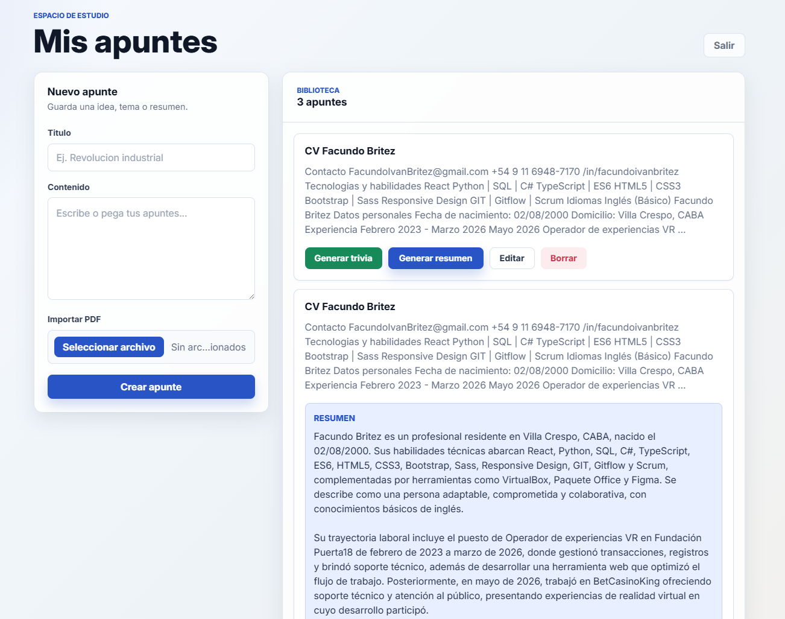

# 📚 EstudIA


EstudIA es una aplicación web desarrollada para ayudar a estudiantes a organizar sus apuntes y potenciar su estudio mediante Inteligencia Artificial. Permite almacenar notas en la nube, generar resúmenes y trivias automáticamente a partir de su contenido y estudiar desde cualquier dispositivo.

---

# ✨ Funcionalidades

- 🔐 Inicio de sesión con Google mediante Supabase Auth.
- 📝 Crear, editar, eliminar y visualizar apuntes.
- ☁️ Almacenamiento de notas en Supabase.
- 👤 Cada usuario accede únicamente a sus propios apuntes mediante Row Level Security (RLS).
- 🤖 Generación automática de resúmenes utilizando Google Gemini.
- 📚 Generación automática de trivias de opción múltiple utilizando Google Gemini.
- ✅ Corrección automática de respuestas.
- 📊 Visualización del puntaje obtenido.
- 📱 Interfaz responsive.

---

# 🛠 Stack Tecnológico

| Área | Tecnología |
|------|------------|
| Frontend | React + Vite |
| Backend | Node.js + Express |
| Base de Datos | Supabase |
| Autenticación | Supabase Auth (Google OAuth) |
| Inteligencia Artificial | Google Gemini 2.5 Flash |
| Deploy Frontend | Vercel |
| Deploy Backend | Render |

---

# 🏗 Arquitectura

```text
EstudIA/
├── backend/
│   ├── src/
│   │   ├── routes/
│   │   ├── controllers/
│   │   ├── services/
│   │   └── app.js
│   ├── index.js
│   └── package.json
│
├── frontend/
│   ├── src/
│   │   ├── components/
│   │   ├── pages/
│   │   ├── lib/
│   │   ├── App.jsx
│   │   └── main.jsx
│   ├── public/
│   └── package.json
│
├── README.md
└── .gitignore
```

---

# 🔄 Flujo de la aplicación

1. El usuario inicia sesión con Google.
2. Se autentica mediante Supabase Auth.
3. Puede crear, editar y eliminar apuntes.
4. Los apuntes se almacenan en Supabase.
5. El usuario puede generar un resumen o una trivia basada únicamente en el contenido del apunte.
6. El frontend envía el contenido de la nota al backend.
7. El backend consulta la API de Google Gemini.
8. Gemini devuelve la respuesta en formato JSON.
9. El frontend muestra el resumen o permite responder la trivia y visualizar el puntaje.

---

# 🚀 Cómo ejecutar el proyecto

## Clonar el repositorio

```bash
git clone https://github.com/FacuBritez/EstudIA.git
cd EstudIA
```

## Backend

```bash
cd backend
npm install
npm run dev
```

Servidor:

```
http://localhost:3000
```

## Frontend

```bash
cd frontend
npm install
npm run dev
```

Aplicación:

```
http://localhost:5173
```

---

# 🔑 Variables de entorno

## Backend (.env)

```env
GEMINI_API_KEY=tu_api_key
```

## Frontend (.env)

```env
VITE_API_URL=http://localhost:3000
```

En producción, `VITE_API_URL` debe apuntar a la URL pública del backend desplegado en Render.

---

# 📸 Captura de pantalla



---

# 🤖 Uso de Inteligencia Artificial

EstudIA utiliza **Google Gemini 2.5 Flash** para generar contenido educativo a partir de los apuntes del usuario.

La IA se utiliza para:

- Generar resúmenes automáticos.
- Crear trivias de cinco preguntas de opción múltiple.
- Devolver la información estructurada en formato JSON para facilitar su procesamiento en el backend.

---

# 👨‍💻 Autor

**Facundo Brítez**

Proyecto desarrollado para el curso de Inteligencia Artificial de Digital House.
